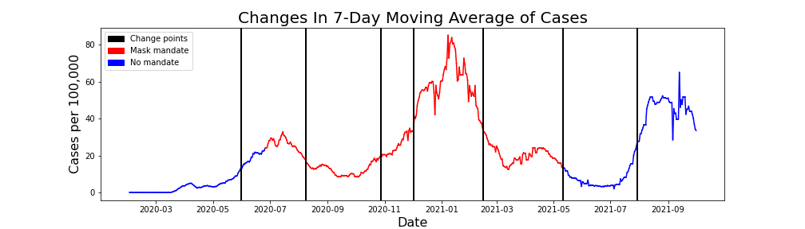

# data-512-project Mecklenburg North Carolina

This repository contains the necessary data files, notebook, and visualization for step 1 of the DATA 512 project. The goal of this assignment is to model the COVID-19 cases for Mecklenburg North Carolina from February 1, 2020 through October 1, 2021 to determine what impact masking had on new cases. The new COVID-19 cases data comes from [John's Hopkins University](https://www.kaggle.com/datasets/antgoldbloom/covid19-data-from-john-hopkins-university), the mask mandate data comes from [the CDC](https://data.cdc.gov/Policy-Surveillance/U-S-State-and-Territorial-Public-Mask-Mandates-Fro/62d6-pm5i), and the mask mandate compliance data comes from [the New York Times](https://github.com/nytimes/covid-19-data/tree/master/mask-use). The full CDC mask mandate dataset is not in the repository as it was too large. Instead the dataset present is the CDC data filtered specifically for Mecklenburg, NC. These datasets can be found in the data folder.

The notebook in the main folder of the repository shows the methodology behind the model used for the final visualization. The visualization is in the visualization folder and below:

You can also read more about the visualization [[here](https://docs.google.com/document/d/1HbMRvDy-EwylmDKI4e46nh2O4NyEVP8wiz-sqXRilBg/edit)].
